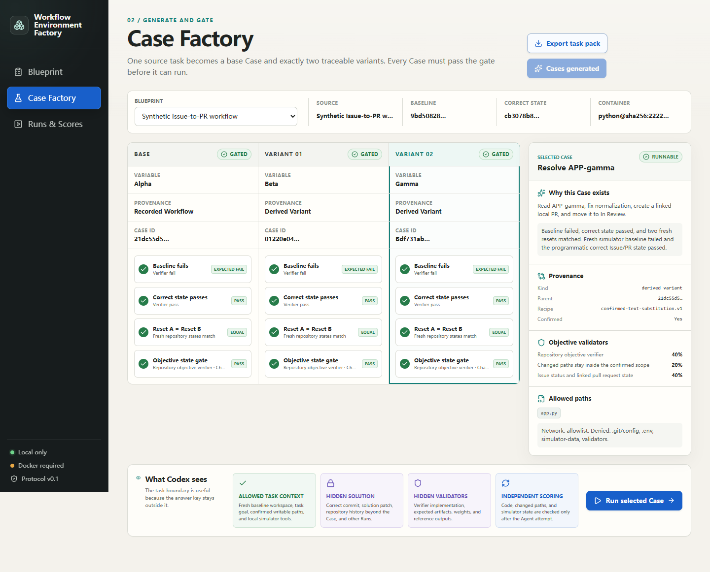
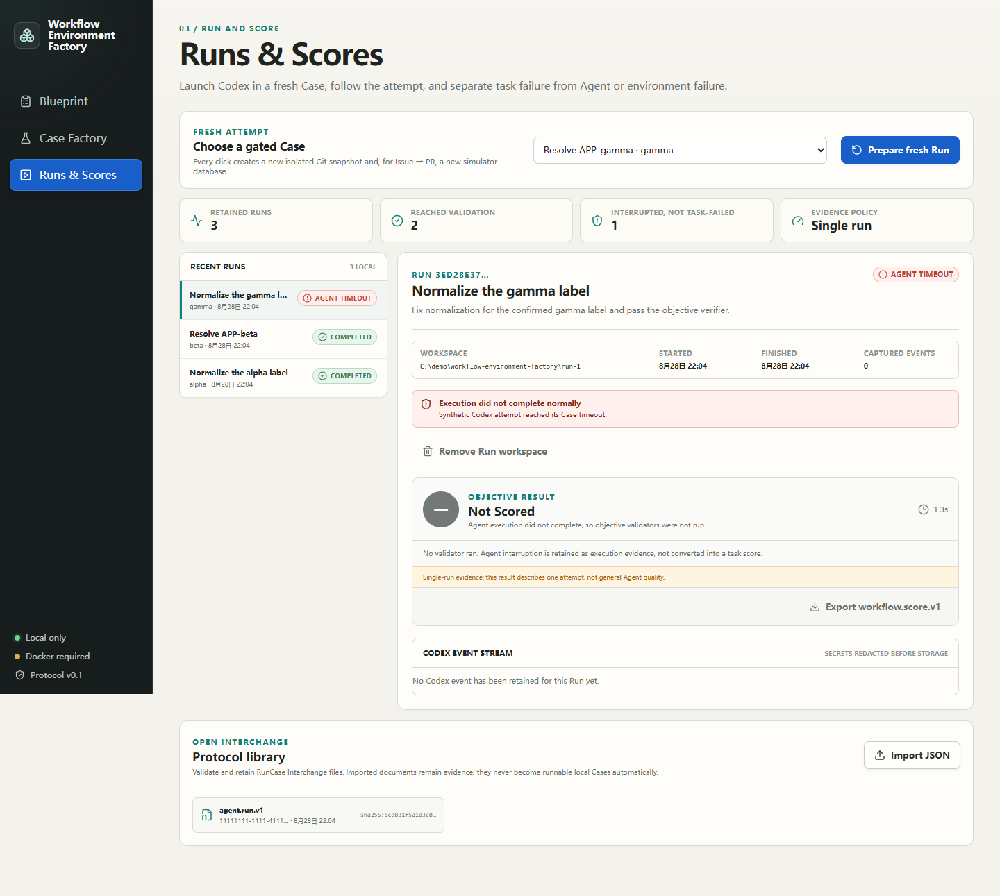

# Workflow Environment Factory

Workflow Environment Factory turns your own repository or Issue-to-PR process into a small, resettable Codex environment: one confirmed source Case, exactly two traceable variants, a fresh state for every attempt, and objective scoring after Codex finishes.

It is not a public benchmark, an environment-outsourcing service, or a dashboard for watching an Agent. The useful output is a task pack you can keep, rerun, inspect, and improve as your repository and workflow change.

> **Release status:** 0.2 technical preview for Codex on Windows 11 x64, Linux x64, and Apple Silicon macOS. Hosted Linux runs the real Docker code and Issue-to-PR gates. Hosted macOS proves the downloadable product lifecycle only; Docker task execution, a physical Mac, an ordinary user-owned clean machine, and an authenticated Codex Run were not tested.



## What you get

The product has three surfaces:

- **Blueprint** connects a local Git repository or records a local Issue-to-PR demonstration, then confirms the variable, baseline, known-correct revision, immutable container, allowed paths, and completion standard.
- **Case Factory** creates a base Case and exactly two user-confirmed variants. A Case is runnable only when its baseline fails, correct state passes, and two fresh resets match. Issue-to-PR Cases also prove that the wrong simulator state fails and the programmatic correct state passes.
- **Runs & Scores** launches Codex in a new isolated Git snapshot and, when needed, a new local Issue/PR database. Task failure, Agent timeout, Agent crash, environment failure, reset failure, and validator failure remain different outcomes.

Runs & Scores also contains a protocol library: it validates, redacts, and retains imported `agent.run.v1`, `workflow.case.v1`, and `workflow.score.v1` files without silently turning an external document into a runnable local Case.

The Codex plugin contributes one bounded Skill and six MCP tools for reading the active Case and operating the local Issue/PR simulator. It has no tool that changes a validator or score. Product-controlled Runs ignore ambient user configuration and register only this same MCP server explicitly; the installed plugin remains the normal user entry point, not an implicit execution dependency.

## The evidence boundary

A generated task is admitted only when all of these are true:

1. the confirmed baseline fails the objective verifier;
2. the known-correct revision passes it;
3. two independently created baseline states have the same fingerprint;
4. each variant has a named parent and a user-confirmed substitution recipe;
5. for Issue-to-PR, a fresh wrong database state fails and a fresh correct state passes.

This proves that the Case distinguishes the two known states. It does **not** prove that a model is generally good, that a generated variant is realistic in every way, or that one passing Run will pass again. Every Score is labeled single-run evidence.

The Agent workspace has no remote, no shared object database, and no object from the known-correct descendant commit. Repository tests that belong to the baseline can remain visible; the product does not pretend that ordinary project tests are hidden. Screenshots are not accepted as the primary score for code or browser workflow state.

## Quick start

Requirements:

- Windows 11 x64, Linux x64, or Apple Silicon macOS;
- a reachable Docker daemon using Linux containers (Docker Desktop on Windows/macOS);
- Python 3.11, 3.12, or 3.13;
- Node.js 22.x;
- Git;
- Codex CLI/Desktop with `codex` on `PATH`;
- PowerShell 7 on Windows, or Bash on Linux/macOS.

Install and start the long-lived service from a normal host terminal: Windows Terminal or PowerShell on Windows, and Bash on Linux/macOS. Do not start it from inside an existing Codex sandbox. Every real Run performs a no-model workspace-sandbox preflight and stops as `environment_error` rather than falling back to unrestricted execution.

On Windows, download `workflow-environment-factory-0.2.0-windows-x64.zip` and its `.sha256` file from the same GitHub Release. Verify the archive, extract it, inspect the installer, then run:

```powershell
$archive = '.\workflow-environment-factory-0.2.0-windows-x64.zip'
$expected = (Get-Content "$archive.sha256").Split()[0]
$actual = (Get-FileHash $archive -Algorithm SHA256).Hash.ToLowerInvariant()
if ($actual -ne $expected) { throw 'Workflow Environment Factory archive checksum mismatch.' }
Expand-Archive $archive -DestinationPath .
Set-Location workflow-environment-factory-0.2.0
.\scripts\Install.ps1 -Open
```

On Linux or Apple Silicon macOS, download `workflow-environment-factory-0.2.0-portable.tar.gz` and its `.sha256` file, then run:

```bash
archive=workflow-environment-factory-0.2.0-portable.tar.gz
node -e 'const fs=require("node:fs"),c=require("node:crypto");const p=process.argv[1],e=fs.readFileSync(p+".sha256","utf8").trim().split(/\s+/)[0],a=c.createHash("sha256").update(fs.readFileSync(p)).digest("hex");if(a!==e)process.exit(1)' "$archive"
tar -xzf "$archive"
cd workflow-environment-factory-0.2.0
chmod +x scripts/*.sh
./scripts/Install.sh --open
```

> On macOS, this command installs the plugin and starts the local service. Docker-backed Case generation, execution, and scoring have not been verified on macOS; the release evidence covers that path on hosted Linux only.

The release contains commit/protocol/Docker-bound manifests and GitHub build-provenance attestations. Each installer creates a project-local Python environment, installs the npm lockfile plus exact Python version constraints, confirms Docker and Codex, registers the extracted checkout as a Codex marketplace, installs the plugin, and starts a loopback-only service. The Python constraints are not a wheel/sdist hash lock. Restart Codex after installation.

To run from source before a packaged protocol dependency exists:

```powershell
git clone https://github.com/rrrrrredy/workflow-environment-factory.git
Set-Location workflow-environment-factory
$env:WEF_NODE = 'C:\path\to\node-v22\node.exe'
$env:WEF_PYTHON = 'C:\path\to\python.exe'
.\scripts\Sync-Protocol.ps1 -ProtocolRoot C:\path\to\runcase-interchange
.\scripts\Install.ps1 -Open
```

See [installation and removal](docs/installation.md) for every state change and the portable start path.

## Normal use

1. Prepare one local repository with a failing baseline commit and a descendant known-correct commit.
2. Pull an image and use its immutable `repository@sha256:…` digest in the Blueprint.
3. For a code task, confirm the value and paths that can become two variants. For Issue-to-PR, first complete the four-step local demonstration recorder.
4. Create the Blueprint, then generate Cases. Do not run any Case whose evidence gate is blocked.
5. Inspect provenance, writable paths, validators, and what Codex cannot see. Export the three-Case task pack if you want a portable record.
6. Prepare a Run. This always creates a new isolated repository snapshot and, for Issue-to-PR, a new SQLite snapshot.
7. Execute with Codex. The plugin exposes only the active local simulator operations.
8. Read the objective Score. Treat a timeout or crash as an execution failure with `not_scored`; treat a workspace preflight or Codex setup failure as `environment_error`. Neither is a failed task.
9. Remove the Run workspace when finished. The retained Case, Run metadata, and Score stay local.



## Privacy and security

- The service only accepts `127.0.0.1` and refuses another bind address.
- A random local token protects every API route; the browser receives an HttpOnly, SameSite=Strict cookie.
- Structured Codex events are redacted before storage. Secret-like fields, bearer tokens, API keys, GitHub tokens, private keys, and oversized content are handled explicitly.
- Docker verifiers run with network disabled, CPU/memory/process limits, a read-only container filesystem, and the fresh workspace mounted read-only. A post-verifier fingerprint rejects any unexpected workspace mutation before scoring.
- The Issue/PR simulator is local SQLite. It never calls GitHub, Linear, or a production account.
- Repository paths and diagnostic content stay on the machine. Protocol exports are explicit user actions.
- The solution revision is used to prove the Case during generation. Agent-facing MCP responses omit its commit and patch digest, and the Run's shallow object database contains only the baseline lineage needed for that snapshot.
- Before a model call, App Server proves that the exact Run directory supports an offline `workspaceWrite` sandbox. The actual Codex command repeats network-off and no-extra-writable-root settings, uses an ephemeral thread, disables ambient user config, plugins, Hooks, Web search, apps, memories, computer use, image generation, and multi-Agent tools, explicitly registers only the local Factory MCP server, and gives model-generated commands only core environment variables plus the isolated Git variables required for `status` and `diff`.

Read [security and local data](docs/security-and-data.md) before using the preview on a sensitive repository.

## Uninstall

```powershell
.\scripts\Uninstall.ps1
```

```bash
./scripts/Uninstall.sh
```

This stops the service and removes the Codex plugin, marketplace entry, and optional startup shortcut. It preserves product data by default. Permanent data removal is a separate explicit action:

```powershell
.\scripts\Uninstall.ps1 -DeleteData
```

```bash
./scripts/Uninstall.sh --delete-data
```

All entry points create only a nonexistent data directory or reuse one with this product's marker; existing unmarked directories are rejected. The uninstaller also rejects files/reparse points and broad protected locations, and never deletes the source checkout.
To obtain machine-readable proof that no service, PID file, Startup shortcut, plugin, or marketplace registration remains, run `.\scripts\Inspect-Installation.ps1 -RequireAbsent` on Windows or `./scripts/Inspect-Installation.sh --require-absent` on Linux/macOS. Add the platform's no-data flag only after an intentional data-deleting uninstall.

## Architecture

- Python 3.11-3.13, FastAPI, Pydantic, SQLite, isolated Git snapshots, and a bounded Docker executor;
- React/Vite local workbench served by the Python service;
- independent Codex plugin with raw-stdio MCP and one Skill;
- local GitHub/Linear-style Issue/PR simulator with database/API validation;
- RunCase Interchange JSON Schemas as the only cross-product dependency.

Workflow Environment Factory does not share a service, database, queue, UI, executor, or product code with Runtime Evolution Workbench. See [architecture](docs/architecture.md).

## Deliberate non-goals for 0.2

No arbitrary production SaaS cloning, production accounts or data, cloud concurrency, reinforcement learning, model training, multi-Agent orchestration, environment marketplace, screenshot-similarity scoring, unreviewed LLM-generated tasks, or support for Agents other than Codex.

## Development and release gates

```powershell
$env:WEF_NODE = 'C:\path\to\node-v22\node.exe'
$env:WEF_PYTHON = 'C:\path\to\python.exe'
.\scripts\Check.ps1 -InstallDependencies
```

The regular check performs a strict React production build, exact Python version-constraint check, static analysis, the two focused golden scenarios, and plugin/MCP validation. The Python file is not an artifact-hash lock. The deterministic Docker gate proves reset and scoring against an immutable image, but does not pretend a hand-applied correct state was produced by Codex. Version 0.2.0 packaging records that the authenticated code and Issue-to-PR Agent gate was not run; that optional gate and ordinary user-owned acceptance remain mandatory before any stable label.

Current evidence and remaining gates are listed in [acceptance](docs/acceptance.md). The tag-to-release gates and fixed Docker input are documented in [release process](docs/release-process.md). Contributions are welcome under [CONTRIBUTING.md](CONTRIBUTING.md); security reports follow [SECURITY.md](SECURITY.md).

## License

Apache-2.0. The permissive license includes an explicit patent grant and permits individual, internal, and commercial use subject to its terms.
