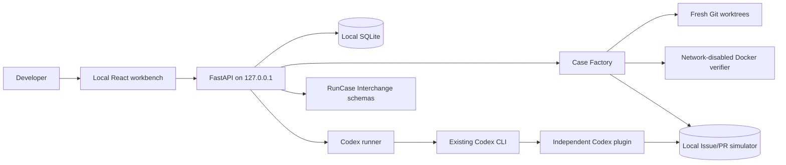

# Architecture

The two products in this project family are deliberately independent. Workflow Environment Factory owns its own service, database, UI, plugin, simulator, and Docker execution path. Its only shared dependency is the versioned RunCase Interchange schema package.

## Main components

### Local API and storage

FastAPI provides one loopback-only product boundary. Pydantic rejects unknown input fields. SQLite stores Blueprint, Case, Run, Score, and recording documents as versioned JSON payloads with relational ownership. Verifier content is stored separately by SHA-256 digest.

The database and content store are private to this product. No Runtime Evolution Workbench service or table is imported.

### Case Factory

`CaseFactory` resolves the exact repository root and commits, requires the known-correct revision to descend from the baseline, and verifies that their diff is non-empty. It applies only confirmed text substitutions to confirmed repository-relative paths.

Generation creates three protocol documents:

- index 0: source Case from repository commits or a confirmed workflow recording;
- index 1 and 2: derived Cases with the source Case as parent and a stored transformation record.

Every Case creates two fresh baseline worktrees, compares their state fingerprints, executes the baseline verifier, and executes the correct-state verifier. Issue-to-PR also creates two fresh simulator databases and proves negative and positive state assertions.

### Run and Score

Preparing a Run never reuses a prior workspace or simulator snapshot. Codex emits JSONL events that are redacted before storage. After Codex exits, scoring reruns the objective verifier, checks changed paths, and checks the simulator database when required.

Execution and task result are separate protocol fields:

- Agent timeout/crash: execution status is retained and task is `not_scored`;
- reset or environment failure: task is `not_scored`;
- verifier infrastructure failure: task is `not_scored`;
- completed validation: task can be `pass` or `fail`.

### Codex plugin

The plugin has no database or executor. It reads the local token and calls the product API. Its six tools can read a Run/Case, read the local Issue, list/create local PRs, and update local Issue status. There is no tool for preparing a Case, changing provenance, changing a validator, scoring, or publishing a result.

### Protocol dependency

The source checkout keeps synced schemas under ignored `.runtime-deps`. Release packages embed exactly the three 0.1 schemas plus dependency metadata. The product validates Case and Score documents before storing or exporting them. OpenTelemetry mappings can be added later but are not the internal source of truth.

## Failure and recovery model

- A process restart converts preparing/running/validating Runs to `environment_error` instead of pretending the task failed.
- Docker timeout removes the named container before returning timeout evidence.
- Failed Run preparation attempts best-effort cleanup and retains cleanup failure text.
- Worktree and simulator cleanup are independent so one error does not silently skip the other.
- The service PID is checked against the exact virtual-environment Python and expected module before it is stopped.

## Why no shared service

Runtime Evolution Workbench improves a user's Codex capability layer from real Run evidence. Workflow Environment Factory manufactures resettable task environments. A shared backend would couple data ownership, release cadence, permissions, and failure modes without creating user value. Versioned files are the integration surface.
