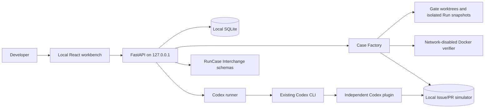

# Architecture

The two products in this project family are deliberately independent. Workflow Environment Factory owns its own service, database, UI, plugin, simulator, and Docker execution path. Its only shared dependency is the versioned RunCase Interchange schema package.

## Main components

### Local API and storage

FastAPI provides one loopback-only product boundary. Pydantic rejects unknown input fields. SQLite stores Blueprint, Case, Run, Score, and recording documents as versioned JSON payloads with relational ownership. Verifier content is stored separately by SHA-256 digest.

The database and content store are private to this product. No Runtime Evolution Workbench service or table is imported.

### Case Factory

`CaseFactory` resolves the exact repository root and commits, requires the known-correct revision to descend from the baseline, and verifies that their diff is non-empty. It applies only confirmed text substitutions to confirmed repository-relative paths.

Generation creates three protocol documents:

- index 0: source Case from repository commits or a confirmed workflow recording;
- index 1 and 2: derived Cases with the source Case as parent and a stored transformation record.

Every Case creates two short-lived baseline worktrees for factory-only gating, compares their state fingerprints, executes the baseline verifier, and executes the correct-state verifier. Issue-to-PR also creates two fresh simulator databases and proves negative and positive state assertions. These generation worktrees are never passed to Codex.

### Run and Score

Preparing a Run never reuses a prior workspace or simulator snapshot. The factory shallow-fetches only the selected baseline into a new object database, checks out a separate working directory with no `.git` marker, removes the temporary fetch ref, and commits the confirmed variant as `HEAD`. There is no remote, alternate object store, or known-correct descendant object. Git metadata stays outside Codex's writable workspace; `GIT_DIR`, `GIT_WORK_TREE`, and `GIT_OPTIONAL_LOCKS=0` provide bounded Git reads without making that metadata part of the workspace.

Before any model-backed call, a separate short-lived App Server process selects the exact restricted permission profile used by the Run. Its no-model shell must write in the generated workspace, fail to read the Factory SQLite database, and fail to run `git show` against the source repository's known-correct commit. The profile grants only minimal runtime reads, the generated workspace, the separate isolated Git directory, and the reviewed MCP script; network stays restricted. An unsupported sandbox backend fails closed and leaves the Run as `environment_error`. The real `codex exec` command uses that same profile, an ephemeral thread, no approvals, no ambient user config, only the Factory MCP server, and core command variables plus the isolated Git variables. Repository AGENTS instructions remain part of the Case because `--ignore-rules` is deliberately not used.

Codex emits JSONL events that are redacted before storage. Before the verifier runs, scoring freezes tracked and untracked changed paths against the isolated `HEAD`; verifier-created cache files therefore cannot be mistaken for Agent changes. It then executes the objective verifier and checks the simulator database when required.

Execution and task result are separate protocol fields:

- Agent timeout/crash: execution status is retained and task is `not_scored`;
- reset or environment failure: task is `not_scored`;
- verifier infrastructure failure: task is `not_scored`;
- completed validation: task can be `pass` or `fail`.

### Codex plugin

The plugin has no database or executor. A managed Run injects a derived, Run-scoped token into its MCP process; the MCP refuses a different Run id. Its six tools can read the active bounded Run/Case view, read the active local Issue, list/create local PRs, and update local Issue status. The token is rejected by Blueprint, score, export, product-data, and other-Run routes. Agent views omit provenance, known-correct commit refs, patch digests, full validation evidence, and scores; the workbench retains that evidence for the user. There is no tool for preparing a Case, changing provenance, changing a validator, scoring, or publishing a result. Managed Runs launch the reviewed MCP script explicitly rather than loading ambient plugins.

### Protocol dependency

The source checkout keeps synced schemas under ignored `.runtime-deps`. Release packages embed exactly the three 0.1 schemas plus dependency metadata. The product validates Case and Score documents before storing or exporting them. OpenTelemetry mappings can be added later but are not the internal source of truth.

## Failure and recovery model

- A process restart converts preparing/running/validating Runs to `environment_error` instead of pretending the task failed.
- A missing Codex executable, App Server workspace preflight failure, or recognized sandbox/auth/connectivity setup failure becomes `environment_error` before scoring; it is never converted into task failure.
- Docker timeout removes the named container before returning timeout evidence.
- Failed Run preparation attempts best-effort cleanup and retains cleanup failure text.
- Isolated workspace/Git-state cleanup and simulator cleanup are independent so one error does not silently skip the other.
- The service PID is checked against the exact virtual-environment Python and expected module before it is stopped.

## Why no shared service

Runtime Evolution Workbench improves a user's Codex capability layer from real Run evidence. Workflow Environment Factory manufactures resettable task environments. A shared backend would couple data ownership, release cadence, permissions, and failure modes without creating user value. Versioned files are the integration surface.
